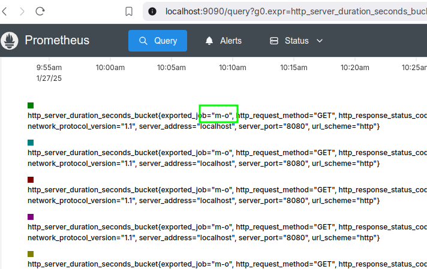
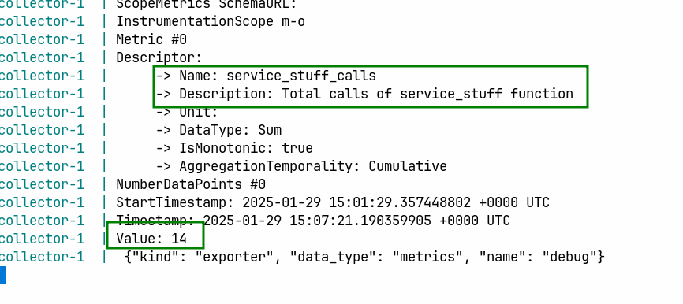

# m-o

Metrics and OTEL

## STDOUT

```shell
➜  m-o git:(main) ✗ cargo run
    Finished `dev` profile [unoptimized + debuginfo] target(s) in 0.10s
     Running `target/debug/m-o`
Metrics
Resource
	 ->  service.name=String(Owned("m-o"))
	Instrumentation Scope #0
		Name         : actix-web-opentelemetry
		Version  : "0.20.1"
		SchemaUrl: "https://opentelemetry.io/schemas/1.28.0"
Metric #0
		Name         : http.server.duration
		Description  : Measures the duration of inbound HTTP requests.
		Unit         : s
		Type         : Histogram
		Temporality  : Cumulative
		Histogram DataPoints
		DataPoint #0
			StartTime    : 2025-01-24 14:07:10.140051
			EndTime      : 2025-01-24 14:08:10.140579
			Count        : 11
			Sum          : 19.837263478000004
			Min          : 1.802292795
			Max          : 1.804464909
			Attributes   :
				 ->  http.route: /
				 ->  http.request.method: GET
				 ->  network.protocol.version: 1.1
				 ->  server.address: localhost
				 ->  server.port: 8080
				 ->  url.scheme: http
				 ->  http.response.status_code: 200
Metric #1
		Name         : http.server.active_requests
		Description  : Measures the number of concurrent HTTP requests that are currently in-flight.
		Unit         :
		Type         : Sum
		Sum DataPoints
		Monotonic    : false
		Temporality  : Cumulative
		DataPoint #0
			StartTime    : 2025-01-24 14:07:10.140114
			EndTime      : 2025-01-24 14:08:10.140644
			Value        : 0
			Attributes   :
				 ->  http.request.method: GET
				 ->  http.route: /
				 ->  network.protocol.version: 1.1
				 ->  server.address: localhost
				 ->  server.port: 8080
				 ->  url.scheme: http
Metric #2
		Name         : http.server.request.size
		Description  : Measures the size of HTTP request messages (compressed).
		Unit         : By
		Type         : Histogram
		Temporality  : Cumulative
		Histogram DataPoints
		DataPoint #0
			StartTime    : 2025-01-24 14:07:10.140175
			EndTime      : 2025-01-24 14:08:10.140685
			Count        : 11
			Sum          : 0
			Min          : 0
			Max          : 0
			Attributes   :
				 ->  http.request.method: GET
				 ->  http.route: /
				 ->  network.protocol.version: 1.1
				 ->  server.address: localhost
				 ->  server.port: 8080
				 ->  url.scheme: http
Metric #3
		Name         : http.server.response.size
		Description  : Measures the size of HTTP response messages (compressed).
		Unit         : By
		Type         : Histogram
		Temporality  : Cumulative
		Histogram DataPoints
		DataPoint #0
			StartTime    : 2025-01-24 14:07:10.140219
			EndTime      : 2025-01-24 14:08:10.140719
			Count        : 11
			Sum          : 55
			Min          : 5
			Max          : 5
			Attributes   :
				 ->  http.route: /
				 ->  http.request.method: GET
				 ->  network.protocol.version: 1.1
				 ->  server.address: localhost
				 ->  server.port: 8080
				 ->  url.scheme: http
				 ->  http.response.status_code: 200
```

## OTEL Collector

```shell
➜  m-o git:(main) ✗ podman compose -f podman-compose.yaml up
>>>> Executing external compose provider "/usr/libexec/docker/cli-plugins/docker-compose". Please see podman-compose(1) for how to disable this message. <<<<

[+] Running 2/2
 ✔ Network m-o_default        Created                                      0.0s
 ✔ Container m-o-collector-1  Created                                      0.2s
Attaching to collector-1
collector-1  | 2025-01-27T10:03:31.650Z info    service@v0.116.0/service.go:164Setting up own telemetry...
collector-1  | 2025-01-27T10:03:31.650Z info    telemetry/metrics.go:70 Serving metrics {"address": "localhost:8888", "metrics level": "Normal"}
collector-1  | 2025-01-27T10:03:31.650Z info    builders/builders.go:26 Development component. May change in the future.    {"kind": "exporter", "data_type": "metrics", "name": "debug"}
collector-1  | 2025-01-27T10:03:31.651Z info    service@v0.116.0/service.go:230Starting otelcol...  {"Version": "0.116.0", "NumCPU": 12}
collector-1  | 2025-01-27T10:03:31.651Z info    extensions/extensions.go:39 Starting extensions...
collector-1  | 2025-01-27T10:03:31.652Z warn    internal@v0.116.0/warning.go:40Using the 0.0.0.0 address exposes this server to every network interface, which may facilitate Denial of Service attacks.    {"kind": "receiver", "name": "otlp", "data_type": "metrics", "documentation": "https://github.com/open-telemetry/opentelemetry-collector/blob/main/docs/security-best-practices.md#safeguards-against-denial-of-service-attacks"}
collector-1  | 2025-01-27T10:03:31.652Z info    otlpreceiver@v0.116.0/otlp.go:112   Starting GRPC server    {"kind": "receiver", "name": "otlp", "data_type": "metrics", "endpoint": "0.0.0.0:4317"}
collector-1  | 2025-01-27T10:03:31.652Z info    service@v0.116.0/service.go:253Everything is ready. Begin running and processing data.
collector-1  | 2025-01-27T10:08:29.083Z info    Metrics {"kind": "exporter", "data_type": "metrics", "name": "debug", "resource metrics": 1, "metrics": 4, "data points": 4}
collector-1  | 2025-01-27T10:08:29.084Z info    ResourceMetrics #0
collector-1  | Resource SchemaURL:
collector-1  | Resource attributes:
collector-1  |      -> service.name: Str(m-o)
collector-1  | ScopeMetrics #0
collector-1  | ScopeMetrics SchemaURL: https://opentelemetry.io/schemas/1.28.0
collector-1  | InstrumentationScope actix-web-opentelemetry 0.20.1
collector-1  | Metric #0
collector-1  | Descriptor:
collector-1  |      -> Name: http.server.duration
collector-1  |      -> Description: Measures the duration of inbound HTTP requests.
collector-1  |      -> Unit: s
collector-1  |      -> DataType: Histogram
collector-1  |      -> AggregationTemporality: Cumulative
collector-1  | HistogramDataPoints #0
collector-1  | Data point attributes:
collector-1  |      -> http.route: Str(/)
collector-1  |      -> http.request.method: Str(GET)
collector-1  |      -> network.protocol.version: Str(1.1)
collector-1  |      -> server.address: Str(localhost)
collector-1  |      -> server.port: Int(8080)
collector-1  |      -> url.scheme: Str(http)
collector-1  |      -> http.response.status_code: Int(200)
collector-1  | StartTimestamp: 2025-01-27 10:07:29.074209842 +0000 UTC
collector-1  | Timestamp: 2025-01-27 10:08:29.075501325 +0000 UTC
collector-1  | Count: 7
collector-1  | Sum: 12.622347
collector-1  | Min: 1.802162
collector-1  | Max: 1.804095
collector-1  | ExplicitBounds #0: 0.000000
collector-1  | ExplicitBounds #1: 5.000000
collector-1  | ExplicitBounds #2: 10.000000
collector-1  | ExplicitBounds #3: 25.000000
collector-1  | ExplicitBounds #4: 50.000000
collector-1  | ExplicitBounds #5: 75.000000
collector-1  | ExplicitBounds #6: 100.000000
collector-1  | ExplicitBounds #7: 250.000000
collector-1  | ExplicitBounds #8: 500.000000
collector-1  | ExplicitBounds #9: 750.000000
collector-1  | ExplicitBounds #10: 1000.000000
collector-1  | ExplicitBounds #11: 2500.000000
collector-1  | ExplicitBounds #12: 5000.000000
collector-1  | ExplicitBounds #13: 7500.000000
collector-1  | ExplicitBounds #14: 10000.000000
collector-1  | Buckets #0, Count: 0
collector-1  | Buckets #1, Count: 7
collector-1  | Buckets #2, Count: 0
collector-1  | Buckets #3, Count: 0
collector-1  | Buckets #4, Count: 0
collector-1  | Buckets #5, Count: 0
collector-1  | Buckets #6, Count: 0
collector-1  | Buckets #7, Count: 0
collector-1  | Buckets #8, Count: 0
collector-1  | Buckets #9, Count: 0
collector-1  | Buckets #10, Count: 0
collector-1  | Buckets #11, Count: 0
collector-1  | Buckets #12, Count: 0
collector-1  | Buckets #13, Count: 0
collector-1  | Buckets #14, Count: 0
collector-1  | Buckets #15, Count: 0
collector-1  | Metric #1
collector-1  | Descriptor:
collector-1  |      -> Name: http.server.active_requests
collector-1  |      -> Description: Measures the number of concurrent HTTP requests that are currently in-flight.
collector-1  |      -> Unit:
collector-1  |      -> DataType: Sum
collector-1  |      -> IsMonotonic: false
collector-1  |      -> AggregationTemporality: Cumulative
collector-1  | NumberDataPoints #0
collector-1  | Data point attributes:
collector-1  |      -> http.route: Str(/)
collector-1  |      -> http.request.method: Str(GET)
collector-1  |      -> network.protocol.version: Str(1.1)
collector-1  |      -> server.address: Str(localhost)
collector-1  |      -> server.port: Int(8080)
collector-1  |      -> url.scheme: Str(http)
collector-1  | StartTimestamp: 2025-01-27 10:07:29.074241094 +0000 UTC
collector-1  | Timestamp: 2025-01-27 10:08:29.075575078 +0000 UTC
collector-1  | Value: 0
collector-1  | Metric #2
collector-1  | Descriptor:
collector-1  |      -> Name: http.server.request.size
collector-1  |      -> Description: Measures the size of HTTP request messages (compressed).
collector-1  |      -> Unit: By
collector-1  |      -> DataType: Histogram
collector-1  |      -> AggregationTemporality: Cumulative
collector-1  | HistogramDataPoints #0
collector-1  | Data point attributes:
collector-1  |      -> http.route: Str(/)
collector-1  |      -> http.request.method: Str(GET)
collector-1  |      -> network.protocol.version: Str(1.1)
collector-1  |      -> server.address: Str(localhost)
collector-1  |      -> server.port: Int(8080)
collector-1  |      -> url.scheme: Str(http)
collector-1  | StartTimestamp: 2025-01-27 10:07:29.074263485 +0000 UTC
collector-1  | Timestamp: 2025-01-27 10:08:29.075615422 +0000 UTC
collector-1  | Count: 7
collector-1  | Sum: 0.000000
collector-1  | Min: 0.000000
collector-1  | Max: 0.000000
collector-1  | ExplicitBounds #0: 0.000000
collector-1  | ExplicitBounds #1: 5.000000
collector-1  | ExplicitBounds #2: 10.000000
collector-1  | ExplicitBounds #3: 25.000000
collector-1  | ExplicitBounds #4: 50.000000
collector-1  | ExplicitBounds #5: 75.000000
collector-1  | ExplicitBounds #6: 100.000000
collector-1  | ExplicitBounds #7: 250.000000
collector-1  | ExplicitBounds #8: 500.000000
collector-1  | ExplicitBounds #9: 750.000000
collector-1  | ExplicitBounds #10: 1000.000000
collector-1  | ExplicitBounds #11: 2500.000000
collector-1  | ExplicitBounds #12: 5000.000000
collector-1  | ExplicitBounds #13: 7500.000000
collector-1  | ExplicitBounds #14: 10000.000000
collector-1  | Buckets #0, Count: 7
collector-1  | Buckets #1, Count: 0
collector-1  | Buckets #2, Count: 0
collector-1  | Buckets #3, Count: 0
collector-1  | Buckets #4, Count: 0
collector-1  | Buckets #5, Count: 0
collector-1  | Buckets #6, Count: 0
collector-1  | Buckets #7, Count: 0
collector-1  | Buckets #8, Count: 0
collector-1  | Buckets #9, Count: 0
collector-1  | Buckets #10, Count: 0
collector-1  | Buckets #11, Count: 0
collector-1  | Buckets #12, Count: 0
collector-1  | Buckets #13, Count: 0
collector-1  | Buckets #14, Count: 0
collector-1  | Buckets #15, Count: 0
collector-1  | Metric #3
collector-1  | Descriptor:
collector-1  |      -> Name: http.server.response.size
collector-1  |      -> Description: Measures the size of HTTP response messages (compressed).
collector-1  |      -> Unit: By
collector-1  |      -> DataType: Histogram
collector-1  |      -> AggregationTemporality: Cumulative
collector-1  | HistogramDataPoints #0
collector-1  | Data point attributes:
collector-1  |      -> http.request.method: Str(GET)
collector-1  |      -> http.response.status_code: Int(200)
collector-1  |      -> http.route: Str(/)
collector-1  |      -> network.protocol.version: Str(1.1)
collector-1  |      -> server.address: Str(localhost)
collector-1  |      -> server.port: Int(8080)
collector-1  |      -> url.scheme: Str(http)
collector-1  | StartTimestamp: 2025-01-27 10:07:29.074283058 +0000 UTC
collector-1  | Timestamp: 2025-01-27 10:08:29.075656112 +0000 UTC
collector-1  | Count: 7
collector-1  | Sum: 35.000000
collector-1  | Min: 5.000000
collector-1  | Max: 5.000000
collector-1  | ExplicitBounds #0: 0.000000
collector-1  | ExplicitBounds #1: 5.000000
collector-1  | ExplicitBounds #2: 10.000000
collector-1  | ExplicitBounds #3: 25.000000
collector-1  | ExplicitBounds #4: 50.000000
collector-1  | ExplicitBounds #5: 75.000000
collector-1  | ExplicitBounds #6: 100.000000
collector-1  | ExplicitBounds #7: 250.000000
collector-1  | ExplicitBounds #8: 500.000000
collector-1  | ExplicitBounds #9: 750.000000
collector-1  | ExplicitBounds #10: 1000.000000
collector-1  | ExplicitBounds #11: 2500.000000
collector-1  | ExplicitBounds #12: 5000.000000
collector-1  | ExplicitBounds #13: 7500.000000
collector-1  | ExplicitBounds #14: 10000.000000
collector-1  | Buckets #0, Count: 0
collector-1  | Buckets #1, Count: 7
collector-1  | Buckets #2, Count: 0
collector-1  | Buckets #3, Count: 0
collector-1  | Buckets #4, Count: 0
collector-1  | Buckets #5, Count: 0
collector-1  | Buckets #6, Count: 0
collector-1  | Buckets #7, Count: 0
collector-1  | Buckets #8, Count: 0
collector-1  | Buckets #9, Count: 0
collector-1  | Buckets #10, Count: 0
collector-1  | Buckets #11, Count: 0
collector-1  | Buckets #12, Count: 0
collector-1  | Buckets #13, Count: 0
collector-1  | Buckets #14, Count: 0
collector-1  | Buckets #15, Count: 0
collector-1  |  {"kind": "exporter", "data_type": "metrics", "name": "debug"}
```

## Prometheus



## Custom metrics





## Minikube with helm

```shell
# start
minikube start --cpus 6 --memory 16000 --disk-size 20gb --addons ingress

# config
set NAMESPACE trustify
set APP_DOMAIN .(minikube ip).nip.io
kubectl create ns $NAMESPACE
kubectl config set-context --current --namespace=$NAMESPACE
```

```shell
# install infra

helm upgrade --install --dependency-update -n $NAMESPACE infra charts/infra --values charts/infra/values.yaml
Release "infra" has been upgraded. Happy Helming!
NAME: infra
LAST DEPLOYED: Thu Jan 30 09:27:33 2025
NAMESPACE: trustify
STATUS: deployed
REVISION: 5
TEST SUITE: None
```

```shell
# build app image within minikube
minikube image build -t m-o -f Containerfile .

# install the app
helm install m-o ./charts/app

# port forward
kubectl port-forward svc/m-o 8080:80

# open a new terminal
curl localhost:8080
```

## :eyes: logs:

```shell
kubectl get pods

kubectl logs infra-otelcol-55db5d985f-ck6br

2025-01-30T12:56:22.034Z    warn    grpc@v1.68.0/clientconn.go:1384 [core]
[Channel #1 SubChannel #2]grpc: addrConn.createTransport failed to connect
to {Addr: "infra-prometheus-server:9494", ServerName: "infra-prometheus-server:9494", }.
Err: connection error: desc = "transport: Error while dialing: dial tcp 10.107.221.251:9494: i/o timeout"
{"grpc_log": true}
```
